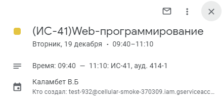
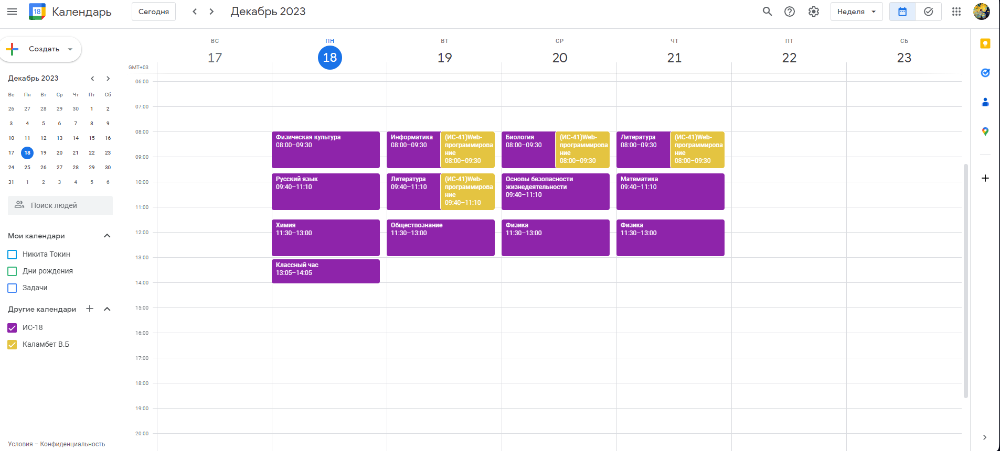

# Project calendar

### Проект сдлеан совместно с [Prog-Maksim](https://github.com/Prog-Maksim) и [CaptainSliva](https://github.com/CaptainSliva). 
#### Это проект для нашего колледжа. Данная программа собирает данные о расписании с сайта колледжа и из Google Sheets. После чего эти данные заносятся в Google календарь.
## Как работает программа?
#### С понедельника по субботу в опредённое время программа запускает скачивание xlsx таблицы за сегодняшний день, после чего проверяет заполненность таблицы. Затем происходит поиск и удаление эвентов за сегодняшний день. Потом данные из таблицы заносятся в календарь в виде новых эвентов. Запуск этих процессов происходит в конце каждой парой.
#### В воскресенье  запускается процесс поиска и удаления эвентов за будущую неделю. Затем происходит парсинг расписания сайта колледжа для групп и преподавателей, а после это расписание заносится в календарь.
#### Расписание создаётся для студентов, групп и кабинетов
#### Также у нас есть телеграм-бот (@RKSI_Calendar_bot), который выдаёт расписание проеподователям и студентам.

